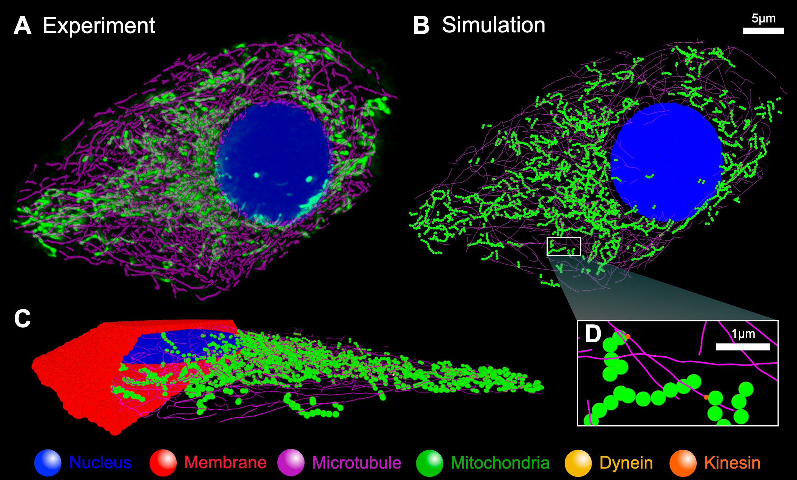

# ReaDDy-Cell



**ReaDDy-Cell** is a whole-cell digital twin simulation framework built on the [ReaDDy](https://github.com/readdy/readdy) particle-based reaction-diffusion platform.
This implementation enables simulation of mitochondrial dynamics and intracellular transport directly from 4D lattice light-sheet microscopy (LLSM) data.
For full details, check out our preprint on BioxRiv! [_Whole-cell particle-based digital twin simulations from 4D lattice light-sheet microscopy data_](https://www.biorxiv.org/content/10.1101/2025.04.09.647865v1)

## Watch some Simulations

- [**Active Transport (Untreated Control)**](https://simularium.allencell.org/viewer?trajUrl=https%3A%2F%2Fdrive.google.com%2Ffile%2Fd%2F1eyHEDfp78OaL4IH4dEBkmvlNlrS67Hiy%2Fview%3Fusp%3Dsharing&t=0)
- ️[**Intermediate Perturbation (Nocodazole 30 min)**](https://simularium.allencell.org/viewer?trajUrl=https%3A%2F%2Fdrive.google.com%2Ffile%2Fd%2F1onIzqaoLaGPEEPLcEFGhRwrXN1T_EyVO%2Fview%3Fusp%3Dsharing&t=0)
- [**Passive Transport (Nocodazole 60 min)**](https://simularium.allencell.org/viewer?trajUrl=https%3A%2F%2Fdrive.google.com%2Ffile%2Fd%2F1Itki_n6GqYijhKW8ZrjxZqQV65l_JBae%2Fview%3Fusp%3Ddrive_link&t=0)

## Features

- **ReaDDy-Made-Models (RMM)**: Image-guided stochastic procedural generation method for
  constructing particle-based models from imaging data.
- **Automated Digital Twin Construction**: Factory methods for building spatially explicit, particle-based models of mitochondria, microtubules, plasma membrane, and nuclear membrane from live-cell imaging data.
- **Passive & Active Transport Dynamics**: Simulates mitochondrial diffusion and directed motor-driven active transport along microtubule topologies.
- **In-Browser Visualization**: Simulation trajectories are rendered using [Simularium Viewer](https://simularium.allencell.org).

## Installation

1. Create and activate a conda environment:

   ```bash
   conda create -n readdy-cell python=3.11
   conda activate readdy-cell
   ```

2. Install dependencies:

   ```bash
   pip install -r requirements.txt
   ```

3. Compile the project:

   ```bash
   ./compile.sh
   ```

4. Run the simulation:
   ```bash
   python -m readdy_cell.main
   ```

## Acknowledgements

ReaDDy-Cell builds upon the excellent work of the [ReaDDy project](https://github.com/readdy/readdy). We thank the original authors and contributors for making their software open-source and extensible.
