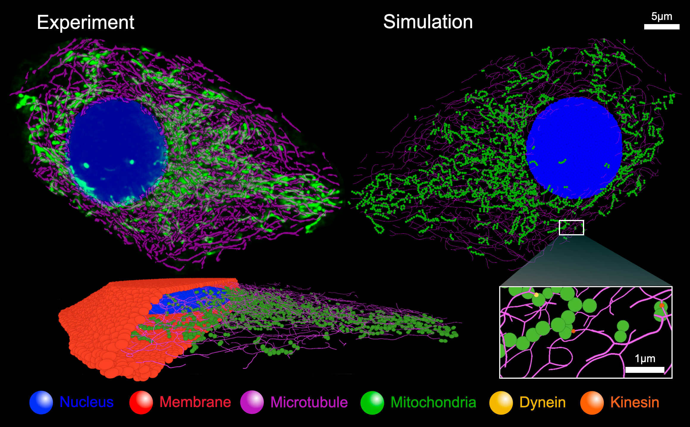

# ReaDDy-Cell

**ReaDDy-Cell** is a whole-cell digital twin simulation framework built on the [ReaDDy](https://github.com/readdy/readdy) particle-based reaction-diffusion platform.
This implementation enables simulation of mitochondrial dynamics and intracellular transport directly from 4D lattice light-sheet microscopy (LLSM) data.
For full details, check out our preprint on BioxRiv! [*Whole-cell particle-based digital twin simulations from 4D lattice light-sheet microscopy data*](https://www.biorxiv.org/content/10.1101/2025.04.09.647865v1)

## Watch some Simulations
- [**Passive Transport (Nocodazole 60 min)**](https://tinyurl.com/Cal27-noco60min)  
- [**Active Transport (Untreated Control)**](https://tinyurl.com/Cal27-control)  
- ️[**Intermediate Perturbation (Nocodazole 30 min)**](https://tinyurl.com/Cal27-noco30min)

## Features
- **Automated Digital Twin Construction**: Factory methods for building spatially explicit, particle-based models of mitochondria, microtubules, plasma membrane, and nuclear envelope from live-cell imaging data.
- **Passive & Active Transport Dynamics**: Simulates mitochondrial diffusion and directed motor-driven active transport along microtubule topologies.
- **In-Browser Visualization**: Simulation trajectories are rendered using [Simularium Viewer](https://simularium.allencell.org).

## Acknowledgements
ReaDDy-Cell builds upon the excellent work of the [ReaDDy project](https://github.com/readdy/readdy). We thank the original authors and contributors for making their software open-source and extensible.

